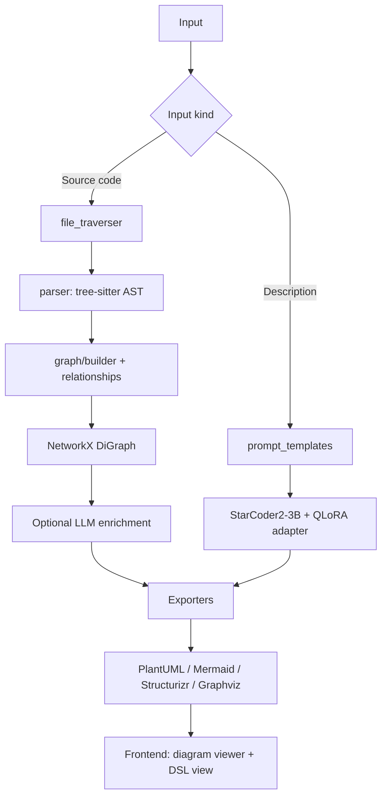

# ArchiGen AI

Automatic generation of software architecture diagrams from source code and natural-language descriptions, combining deterministic AST analysis with a fine-tuned code model and retrieval-augmented generation.

Two input paths, deliberately handled by different machinery:

| Input | Path | Method |
|---|---|---|
| An existing codebase | **Static** | tree-sitter AST → dependency graph → diagram. Deterministic, no model, no API key. |
| A text description | **Generative** | Fine-tuned StarCoder2-3B + ChromaDB retrieval → DSL source. |

The design principle behind the split: when there is ground truth (real code), extraction is exact and a language model can only add error. When there is no ground truth (a prose description), a model is the only option — and that is the case it is trained for.

---

## What's included

- Tree-sitter ingestion for Java and Python (`src/ingestion/`)
- Dependency graph construction and relationship extraction (`src/graph/`)
- Four diagram exporters: PlantUML, Mermaid, Structurizr DSL, Graphviz DOT (`src/exporters/`)
- Prompt templates and per-notation rule sets for all four formats (`src/prompts/`)
- Deterministic dataset builder with round-trip validation (`scripts/build_dataset.py`)
- QLoRA fine-tuning script (`scripts/train.py`)
- Optional LLM enrichment with graceful fallback (`src/ai/`, `src/llm/`)
- ChromaDB retrieval layer: canonical-AST conversion, sentence-transformer embeddings, persistent store, and metadata-filtered query (`src/rag/`)
- FastAPI backend (`src/api/`) — `GET /health`, `POST /generate`, `GET /history`

---

## The problem

Architecture documentation is one of the most consistently neglected parts of the software lifecycle, and the reason is structural rather than cultural: producing diagrams by hand is repetitive, and the result starts decaying the moment the code changes. Teams are then left choosing between maintaining diagrams manually or having documentation that quietly contradicts the system.

The usual alternatives each miss part of the problem:

- **Manual diagram tools** (draw.io, Lucidchart, hand-written PlantUML) produce good output but require sustained manual effort, so they fall out of date.
- **Documentation generators** (Javadoc, Sphinx) produce prose, not an architectural view.
- **IDE visualisations** generally stop at the level of a single file or class, showing structure without system-level relationships.

What is missing is a path that derives the architectural view from the code itself, so it can be regenerated whenever the code changes and cannot drift out of sync.

---

## How it works

### Path A — source code to diagram (static)

No model is involved. Source files are parsed with tree-sitter, and the resulting structures are loaded into a directed graph:

1. **Traversal** — `src/ingestion/file_traverser.py` walks the directory recursively, filtered by extension (`.java`, `.py` by default) and an ignore list (`.git`, `node_modules`, `target`, `build`, …).
2. **Parsing** — `src/ingestion/parser.py` builds concrete syntax trees and extracts classes, interfaces, methods, fields, inheritance, implementations, and package/import information.
3. **Graph construction** — `src/graph/builder.py` produces a `networkx.DiGraph`; `src/graph/relationships.py` resolves and types the edges (`inherits`, `implements`, `composes`, `depends`, `calls`, …).
4. **Optional enrichment** — `src/ai/` asks an LLM to name architectural contexts and summarise responsibilities. Entirely optional: if no client is configured or the call fails, nodes fall back to `"Default Package"` and export proceeds normally.
5. **Export** — `src/exporters/` renders PlantUML, Mermaid, Structurizr DSL, or Graphviz DOT.

Every step is deterministic and sorted, so the same repository produces byte-identical output on every run.

### Path B — description to diagram (generative)

A prose description has no ground truth to extract, so this path generates DSL source with a fine-tuned model:

1. The description is embedded and used to query the ChromaDB knowledge base for similar patterns, optionally filtered by notation (`query_knowledge_base(query, filter_meta={"format": ...})`).
2. The description and any retrieved context are formatted with the prompt template for the target notation (`src/prompts/prompt_templates.py`).
3. The model generates DSL source.

### Pipeline



---

## Repository layout

```text
UML_Diagram_Generator/
├── src/
│   ├── api/                  FastAPI backend: /health, /generate, /history
│   ├── ai/                   Optional LLM enrichment: context naming, summaries
│   ├── dataset/              PlantUML parsing + graph similarity (round-trip validation)
│   ├── evaluation/           Static-vs-LLM comparison metrics
│   ├── exporters/            PlantUML, Mermaid, Structurizr, Graphviz DOT
│   ├── generation/           LLM-backed diagram generation
│   ├── git_integration/      Git hook runner + merge-request comments
│   ├── graph/                NetworkX graph builder + edge extraction
│   ├── ingestion/            Recursive traversal + tree-sitter parsing (Java, Python)
│   ├── llm/                  LLM client (OpenAI-compatible) + factory with lazy imports
│   ├── prompts/              Prompt templates + notation rules per format
│   ├── rag/                  ChromaDB vector store: AST conversion, embeddings, filtered query, seeding
│   ├── schemas/              Pydantic models
│   └── config.py             Environment-driven settings
├── scripts/
│   ├── download_model.py     Fetch + verify the base model from the Hub
│   ├── build_dataset.py      Deterministic dataset builder (label factory)
│   └── train.py              QLoRA supervised fine-tuning
├── frontend/                 Vue 3 + Vite + IBM Carbon
│   └── src/{components,api,composables,styles}
├── data/                     train.jsonl, val.jsonl
├── models/                   LoRA adapter output directory
├── plans/                    Design notes
└── requirements.txt
```

`repos/` holds the open-source repositories the dataset is built from. It is a local working directory and should not be committed — see [Licensing](#licensing-and-acknowledgements).

---

## Quick start

Requires Python 3.10+ (developed against 3.14).

```bash
git clone <this-repo>
cd UML_Diagram_Generator

python -m venv .venv
source .venv/bin/activate        # Windows: .venv\Scripts\activate
pip install -r requirements.txt
```

Start the API:

```bash
uvicorn src.api.main:app --reload --port 8000
```

Then, in `frontend/`:

```bash
npm install
npm run dev          # http://localhost:5173
```

The Vite dev server proxies `/api/*` to port 8000 and strips the prefix, so no environment configuration is needed. To run the UI with no backend at all, set `VITE_USE_MOCK=true`.

`POST /generate` accepts `{mode, content, diagram_type, format, use_ai, use_rag}`, where `mode` is `text`, `story`, `code` (a pasted snippet) or `folder` (a local directory path). Interactive API docs are at `http://localhost:8000/docs`.

### LLM configuration

The `text` and `story` modes need an LLM. Copy `.env.example` to `.env` and set:

```bash
LLM_API_KEY=sk-...
LLM_MODEL=gpt-4o-mini
```

`LLM_BASE_URL` defaults to OpenAI. Point it at any OpenAI-compatible endpoint — a local vLLM or Ollama server, for example — to keep inference on-machine, in which case an API key is optional. The `folder` and `code` modes need no key at all: they run entirely on static analysis.

---

## Fine-tuning

### Model

**StarCoder2-3B** (BigCode) — a 3B code-specialised model. Chosen for its size (fits a consumer GPU under 4-bit quantisation), its prior over structured text, and its permissive licence.

### Method: QLoRA

Training a 3B model directly needs tens of GB of VRAM. QLoRA reduces this on two axes:

- **4-bit NF4 quantisation** of the frozen base weights (~4x memory reduction)
- **LoRA adapters** — small low-rank matrices trained instead of the full weights

The adapter is well under 1% of total parameters.

### Configuration

```python
# scripts/train.py
BitsAndBytesConfig(load_in_4bit=True, bnb_4bit_quant_type="nf4",
                   bnb_4bit_compute_dtype=torch.bfloat16)

LoraConfig(r=16, lora_alpha=32, lora_dropout=0.05,
           target_modules="all-linear", task_type="CAUSAL_LM")
```

### Training hyperparameters

| Parameter | Value |
|---|---|
| Base model | `bigcode/starcoder2-3b` |
| Quantisation | 4-bit NF4, bf16 compute |
| LoRA rank / alpha / dropout | 16 / 32 / 0.05 |
| LoRA target modules | `all-linear` |
| Epochs | 2 |
| Learning rate | 2e-4, cosine schedule |
| Warmup | 20 steps |
| Train batch size per device | 2 |
| Eval batch size per device | 2 |
| Gradient accumulation | 8 (effective batch 16) |
| Max sequence length | 2,048 tokens |
| Loss | Completion tokens only |
| Gradient checkpointing | Enabled |
| Precision | bf16 |
| Eval / save interval | every 25 steps |
| Seed | 42 |
| Steps per epoch | 97 (194 total) |

Hardware: a single consumer GPU with 8 GB VRAM (RTX 4060 Laptop); training peaks around 4.6 GB. Evaluation is deliberately run at a **smaller batch size than training** — it has no backward pass, so gradient checkpointing does not reduce its activation memory, and the library default of 8 exhausts 8 GB. Saving is step-based rather than epoch-based because the Trainer evaluates before it saves, so an evaluation failure would otherwise discard a whole epoch.

### Running

```bash
python scripts/download_model.py                                     # ~11 GB, into the HF cache
python scripts/build_dataset.py ./repos/* --out data | tee build.log
python -u scripts/train.py --data data --out models/starcoder2-3b-lora 2>&1 | tee train.log
```

`download_model.py` prints the resolved snapshot path and verifies every weight shard's safetensors header, so a truncated download is caught before training starts. It is resumable, and `--list` shows what would be fetched without downloading anything.

Use `python -u`: the Trainer writes progress to stdout, which is block-buffered when piped, so without it loss values lag behind the progress bar by up to a buffer's worth of steps.

---

## Evaluation

| Metric | Definition |
|---|---|
| **Validity rate** | Fraction of generated diagrams that parse successfully |
| **Entity precision / recall / F1** | Recovered types vs. ground truth |
| **Edge precision / recall / F1** | Recovered relationships vs. ground truth |
| **Relationship type accuracy** | Correct edge type among correctly identified edges |
| **Context overlap** | Agreement between package grouping and model-suggested contexts |

These are the metrics that matter for this task, and they are deliberately not loss-based. Per-token accuracy and loss both look excellent long before output is *usable*: a 200-token diagram generated at 99% per-token accuracy is still only correct end-to-end about 13% of the time (`0.99^200 ~= 0.13`), because a single malformed token invalidates the whole diagram. Validity rate is the honest measure.

`src/evaluation/comparator.py` contains the static-vs-LLM comparison functions (`compare_entity_detection`, `compare_relationship_detection`, `compare_context_quality`) that the harness will build on.

---

## Tech stack

| Component | Technology |
|---|---|
| Code parsing | tree-sitter, tree-sitter-java, tree-sitter-python |
| Dependency graph | NetworkX |
| Fine-tuning | PEFT (LoRA), bitsandbytes 4-bit NF4, TRL `SFTTrainer` |
| Base model | StarCoder2-3B (BigCode) |
| LLM client | OpenAI-compatible Responses API (`src/llm/`) |
| API server | FastAPI, Uvicorn |
| Diagram output | PlantUML (primary), Mermaid, Structurizr DSL, Graphviz DOT |
| Frontend | Vue 3, Vite, IBM Carbon Design System, Mermaid.js |
| Data processing | pandas |
| Language | Python 3.14 (development), 3.10+ supported |

---

## Known limitations

- **Enrichment requires an API key.** The optional context/summary step needs a configured LLM client. Without one it silently falls back to `"Default Package"`, which is safe but produces less informative diagrams.
- **Generation history is in-memory.** `GET /history` keeps the last 50 generations inside the running process; restarting the server clears them and nothing is written to disk.
- **`code` mode infers the language.** A pasted snippet is written to a temporary file and parsed as Java if it contains explicit Java markers, otherwise as Python. The guess is reported in the response `warnings`.
- **Static path only handles Java and Python.** Other languages need additional tree-sitter grammars and extraction rules.
- **Overlapping modules.** `src/evaluation/comparator.py` implements a static-vs-LLM benchmark whose surrounding exploratory code is dead; only its metric functions are intended to survive.

---

## Licensing and acknowledgements

The project's own source code is released under the **MIT licence** — see [`LICENSE`](LICENSE).

Two things to check before redistributing the data this project derives:

- **The training corpus is derived from third-party open-source repositories.** `repos/` holds local clones and `data/*.jsonl` holds diagrams derived from them. Licences vary (MIT, Apache-2.0, BSD, and others) and **must be verified before redistributing** `data/` or `models/`.
- **`repos/` and `data/` should not be committed.** They are large and third-party. See `.gitignore`.

Built on the work of the [tree-sitter](https://tree-sitter.github.io/) project, [BigCode](https://github.com/bigcode-project) (StarCoder2), [TRL](https://github.com/huggingface/trl), [PEFT](https://github.com/huggingface/peft), and [IBM Carbon](https://carbondesignsystem.com/).
