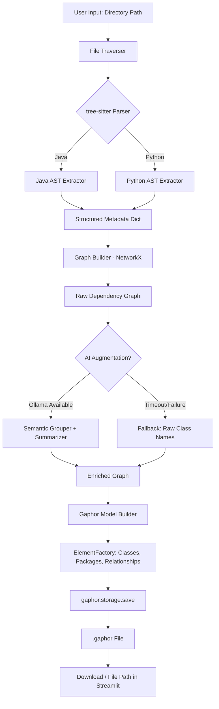

# Architecture Diagram Generator — Technical Plan

## Project Structure

```
AI_project/
├── plans/
│   └── architecture-plan.md          # This document
├── src/
│   ├── __init__.py
│   ├── main.py                       # Streamlit UI + orchestration entry point
│   ├── config.py                     # Constants, defaults, Ollama endpoint
│   ├── ingestion/
│   │   ├── __init__.py
│   │   ├── file_traverser.py         # Walk directory, filter by extension
│   │   └── parser.py                 # tree-sitter parse: Java + Python AST extraction
│   ├── graph/
│   │   ├── __init__.py
│   │   ├── builder.py                # NetworkX graph construction from parsed metadata
│   │   └── relationships.py          # Edge classification: Inheritance, Implementation, Composition, Dependency
│   ├── ai/
│   │   ├── __init__.py
│   │   ├── ollama_client.py          # HTTP client to Ollama REST API
│   │   ├── semantic_grouper.py       # Cluster connected classes → suggest bounded context names
│   │   └── summarizer.py             # Class → 1-sentence responsibility label
│   └── gaphor_gen/
│       ├── __init__.py
│       ├── model_builder.py          # ElementFactory, UML element creation
│       └── serializer.py            # Save .gaphor XML via gaphor.storage
├── requirements.txt
└── README.md
```

## Data Flow Diagram



## Phase Details

### Phase 0: Project Scaffolding
- **files:** `requirements.txt`, all `__init__.py` files, `src/config.py`, `src/main.py` (stub)
- **dependencies:**
  ```
  tree-sitter>=0.20.0
  networkx>=3.0
  streamlit>=1.28.0
  gaphor>=2.25.0
  requests>=2.31.0
  ```
- `config.py` stores: `OLLAMA_URL = "http://localhost:11434"`, `OLLAMA_MODEL = "phi3:mini"`, supported file extensions, timeout values

### Phase 1: Static Analysis & Data Ingestion
- **Input:** Absolute directory path (string)
- **`file_traverser.py`:** Recursively walks directory with `os.walk`, collects files matching `*.java` and `*.py`. Ignores hidden dirs (`.git`, `__pycache__`, `node_modules`).
- **`parser.py`:** For each file:
  1. Read source text.
  2. Select correct `tree-sitter` language grammar (`tree-sitter-java` / `tree-sitter-python`).
  3. Parse → CST/AST.
  4. Traverse tree to extract:
     - **Classes:** name, superclass, implemented interfaces, methods list
     - **Interfaces:** name, methods list
     - **Methods:** name, return type, parameter types
  5. Filter out standard library references (regex-based filtering for `java.*`, `jakarta.*`, `org.springframework.*`, Python builtins).
- **Output:** `Dict[str, Any]` with shape:
  ```python
  {
      "classes": [
          {
              "name": "UserService",
              "file_path": "src/service/UserService.java",
              "superclass": "BaseService",
              "interfaces": ["IUserService"],
              "methods": [
                  {"name": "findById", "return_type": "User", "params": ["Long"]}
              ],
              "imports": ["com.example.model.User", "com.example.repo.UserRepository"],
              "package": "com.example.service"
          }
      ],
      "interfaces": [...]
  }
  ```

### Phase 2: Relationship Extraction & Graph Construction
- **Input:** Metadata dict from Phase 1
- **`builder.py`:**
  1. Initialize `nx.DiGraph()`.
  2. For each class/interface in metadata, add a node with attributes: `type` (class/interface), `file_path`, `package`, `methods`.
  3. Call `relationships.extract_edges(metadata, graph)`.
- **`relationships.py`:** Edge extraction logic:
  - **Inheritance:** Class A → Class B when A's `superclass` == B's name.
  - **Implementation:** Class A → Interface I when I is in A's `interfaces` list.
  - **Composition:** Class A → Class B when A's constructor parameter types OR field types include B (requires deeper AST inspection of field declarations and constructor bodies).
  - **Dependency:** Class A → Class B when B is found in A's imports AND used in method parameters/return types but NOT in constructor (i.e., not composition).
  - Each edge gets an `edge_type` attribute.
- **Output:** `nx.DiGraph` with all nodes and classified edges.

### Phase 3: AI Augmentation
- **Input:** Raw `nx.DiGraph` from Phase 2
- **`ollama_client.py`:**
  - Wraps `requests.post` to `http://localhost:11434/api/generate`.
  - Payload: `{"model": "phi3:mini", "prompt": "...", "stream": false, "options": {"temperature": 0.1}}`.
  - Timeout: 30s. On failure → return `None`.
- **`semantic_grouper.py`:**
  1. Extract connected components from the graph.
  2. For each component, build a prompt listing class names and their relationships.
  3. Ask SLM: _"Given these connected classes, suggest a concise architectural layer or bounded context name (e.g., 'Security Context', 'User Domain', 'Persistence Layer'). Return ONLY the name, no explanation."_
  4. Map each class in that component to the returned context name.
  5. On failure → default context name = `"Default Package"`.
- **`summarizer.py`:**
  1. For each class with >5 methods, build a prompt with class name, methods, superclass, interfaces.
  2. Ask SLM: _"Summarize this class's responsibility in ONE short sentence."_
  3. Store as node attribute `responsibility`.
  4. On failure → `responsibility = ""`.
- **Output:** Enriched `nx.DiGraph` with `context` and `responsibility` node attributes.

### Phase 4: Direct Gaphor Model Generation
- **Input:** Enriched `nx.DiGraph`
- **`model_builder.py`:**
  1. `from gaphor.core.modeling import ElementFactory`
  2. `element_factory = ElementFactory()`
  3. Create `Package` elements for each unique `context` value.
  4. For each graph node:
     - If `type == "interface"` → `element_factory.create(UML.InterfaceItem)` (Interface)
     - If `type == "class"` → `element_factory.create(UML.ClassItem)` (Class)
     - Assign `.name = node_name`, `.package = context_package`
  5. For each graph edge:
     - `Inheritance` → `element_factory.create(UML.GeneralizationItem)` 
     - `Implementation` → `element_factory.create(UML.RealizationItem)`
     - `Composition` → `element_factory.create(UML.AssociationItem)` with aggregation
     - `Dependency` → `element_factory.create(UML.DependencyItem)`
  6. Return the `element_factory`.
- **`serializer.py`:**
  - `from gaphor.storage import storage`
  - `with open(output_path, "w") as f: storage.save(element_factory, f)`
  - Returns path to `.gaphor` file.
- **Output:** Valid `.gaphor` XML file.

### Phase 5: Minimal Streamlit UI
- **`main.py`:**
  - `st.title("Architecture Diagram Generator")`
  - `st.text_input("Codebase Directory Path")`
  - `st.button("Generate Architecture")`
  - On click:
    1. `st.spinner("Analyzing source files...")` → Phase 1
    2. `st.spinner("Building dependency graph...")` → Phase 2
    3. `st.spinner("AI enrichment (this may take a moment)...")` → Phase 3
    4. `st.spinner("Generating .gaphor model...")` → Phase 4
    5. `st.success("Done!")` + download button for `.gaphor` file
  - Display graph statistics: node count, edge count, context names found.

## Key Design Decisions

1. **tree-sitter over AST module:** The standard `ast` module only works for Python. Using `tree-sitter` with language grammars gives us a uniform parsing API across Java and Python, and is easier to extend to more languages (C#, TypeScript, etc.).

2. **No intermediate Mermaid:** Skipping Mermaid eliminates an unnecessary serialization step and ensures the Gaphor model retains full UML semantics (aggregation vs. association, realization vs. generalization).

3. **SLM for semantic enrichment only:** The structural extraction is deterministic via tree-sitter — the SLM only handles subjective tasks (naming contexts, summarizing purpose). This keeps the core architecture reproducible.

4. **Graceful AI fallback:** If Ollama is unreachable, the system produces a fully valid `.gaphor` file with raw class/package names. AI is an enhancement, not a requirement.

5. **Phi3:mini:** Chosen for speed and low resource usage. Temperature set to 0.1 for consistent, near-deterministic outputs from the same input.

## Gaphor API Compatibility Notes

The Gaphor Python API has evolved. Key imports to verify at implementation time:
- `gaphor.UML` — contains UML model elements (Class, Interface, Package, Association, Generalization, Dependency, Realization)
- `gaphor.core.modeling.ElementFactory` — factory for creating model elements
- `gaphor.storage.storage.save` — serializes model to `.gaphor` file

If using Gaphor 3.x, the API may differ. The code should handle this with a version check or try/except on imports.
